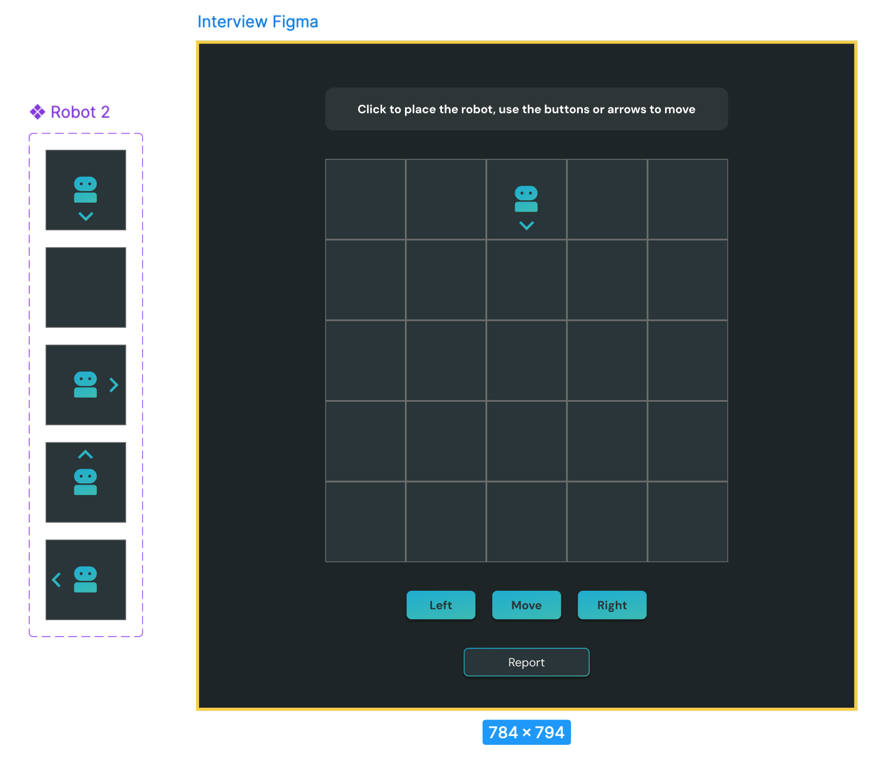

# Toy Robot Simulator

## Description

- This application simulates a toy robot moving on a 5x5 square tabletop. 

- The tabletop has no obstructions.

- The robot can move freely on the tabletop but must not fall off.

- Clicking on a table space will PLACE the robot on the table at the clicked position (using X, Y coordinates), facing north.

- The origin (0,0) is at the SOUTH WEST corner of the table (bottom left).

- The first valid command is a PLACE command. Subsequent commands can be issued in any order, including another PLACE command (i.e. you can click another space and it would place the original toy robot on that space).

- MOVE will move the toy robot one space forward in the direction it is currently facing.

- LEFT and RIGHT will rotate the robot 90 degrees in the specified direction without changing the position of the robot.

- REPORT will announce the X,Y position and F (facing direction) of the robot.

- A robot not on the table ignores commands.

- Commands can be issued via buttons on the page or arrow keys 

- Provide test instructions to exercise the application.

## Constraints

- The toy robot must not fall off the table during movement. This also includes the initial placement of the toy robot. (i.e. clicking off the table should do nothing)

- Any move that would cause the robot to fall must be ignored.

# Figma Design

## Deliverables

- This can be built in any component-based frontend framework or library that you’re comfortable with. (i.e. angular, react, vue, ember, etc.)

- The source files, the test data and any test code in a git repo.

- If anything is unclear, make an assumption and document that assumption and why you think it’s the right assumption. 	

- Aside from functionality, we are looking for readable and maintainable code, testing, documentation, and adherence to the designs.

- If for some reason you think it’s best to deviate from the designs, just document that. We will not be looking at being pixel-perfect.

- Unit tests are also expected, if you run out of time to write all the unit tests you want to write, write a few representative ones and document the others you would have liked to write.

- Time box: Try not to spend more than 4 hours on this exercise.